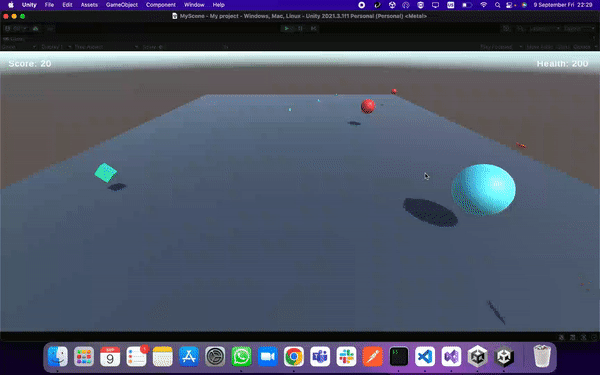

# Murderous Spheres

__Murderous Spheres__ is a simple shooting game developed with Unity.

## Game Mechanics

### Player

The player controls a sphere which can move forward/back/right/left and shoot projectiles. When the health bar of the player hits zero, the game ends.

### Enemies

Enemies have three difficulty levels according to which their health and damage increase: easy, normal and hard. They spawn and shoot projectiles at a pre-determined interval. As the game progresses, the more difficult enemies spawn more.

### Health Potions

Health potions spawn at random locations and always heal the same amount.

### Score

The score increases when the player kills an enemy and the points gained depend on the difficulty of the enemy killed.

### Sound Effects

Player and enemy projectiles make a sound when they are instantiated. Health potions make a sound when they are instantiated and when they are consumed.

### UI

The score and the health of the player are respectively displayed on the upper left and right corners of the screen.

## Sample Gameplay

